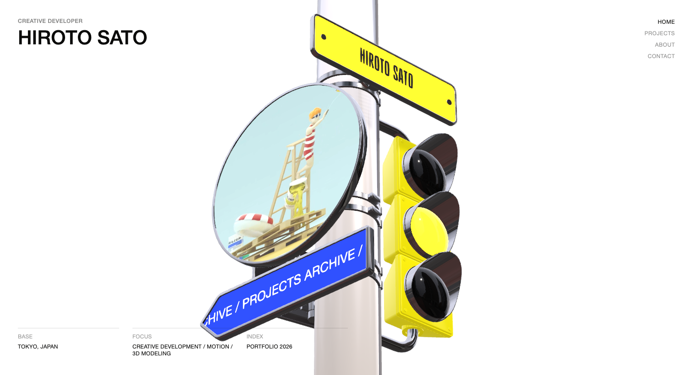
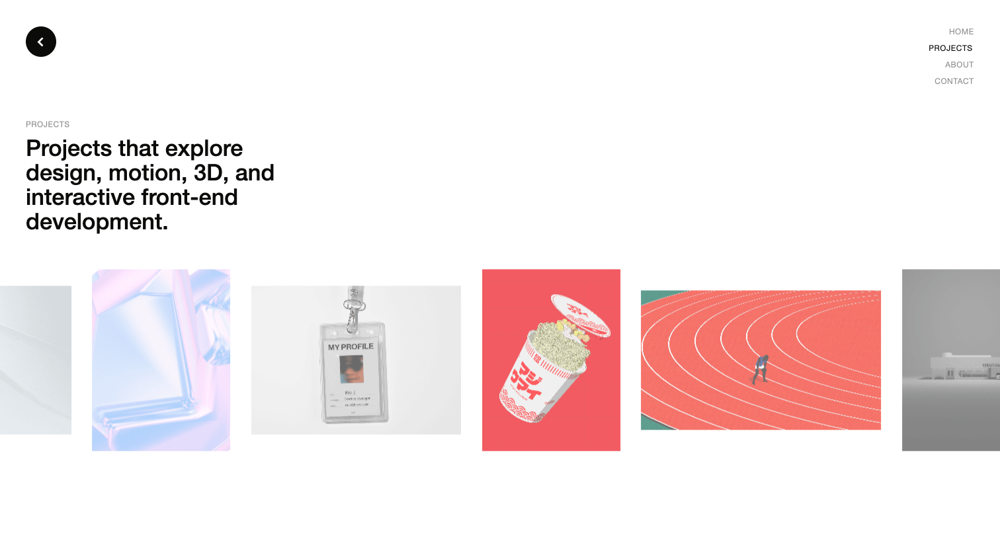
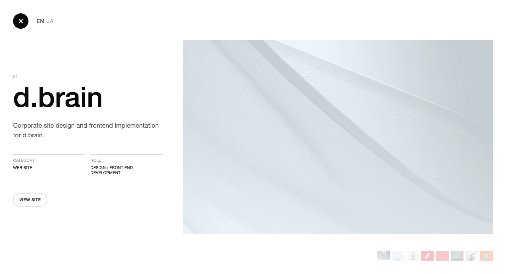
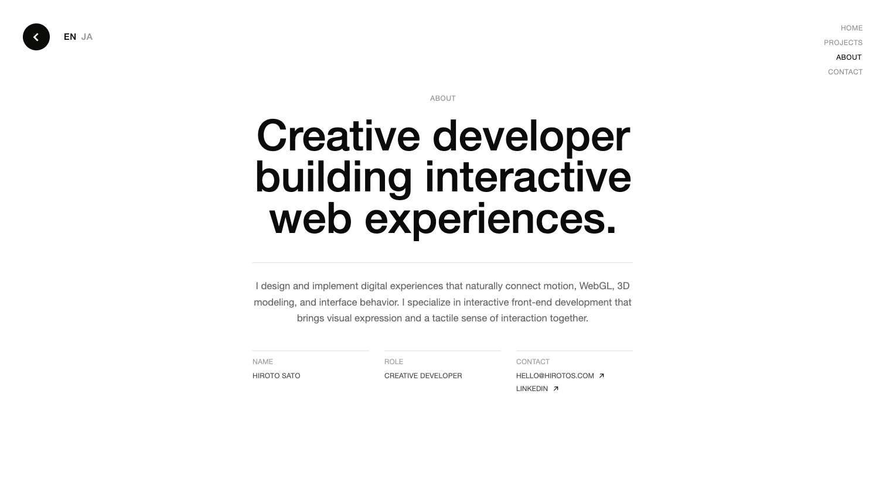
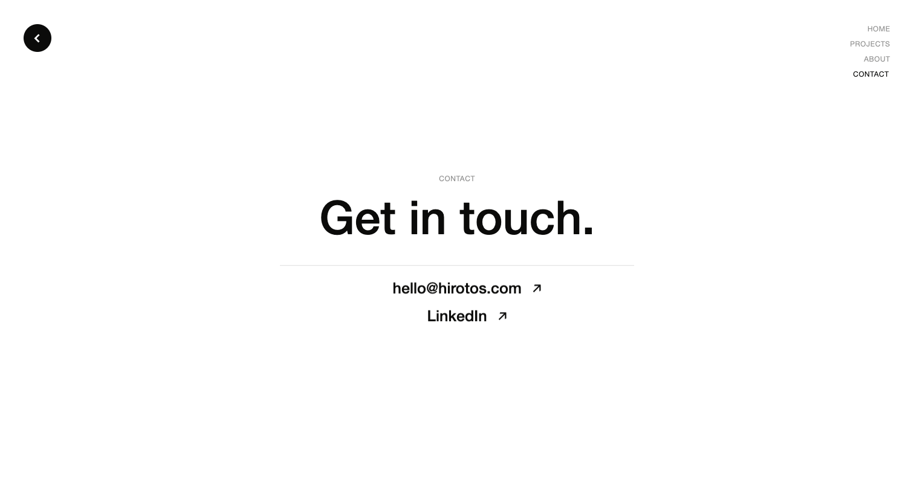

# Hiroto Sato 网站参考规范

采集日期：2026-09-09。参考站点：[hirotos.com](https://www.hirotos.com/)。这是原站的定格档案，不是当前 portfolio 已实现的规格，也不表示下列检查项已经在我们的项目中通过。

## 阅读入口与证据等级

- [逐项核对清单](CHECKLIST.md)：后续实现与验收直接按编号进行。
- [字体、字号与响应式公式](TYPOGRAPHY.md)：避免按截图猜字体和尺寸。
- [浏览器实测尺寸](MEASUREMENTS.md)：坐标、宽高、颜色和间距，保留不同视口。
- [截图与录像索引](EVIDENCE.md)：按页面、语言、状态查找。
- [资源与技术参数](ASSETS.md)：模型、材质、贴图、字体来源。
- [机器可读规格](specification.json)、[来源与文件校验值](manifest.json)。

**S＝源代码/CSS/公开资源中的明确参数；B＝浏览器 computed style、DOM、实际字体或操作结果；V＝截图/录像观察；U＝未验证。** 文中未写“估计”的尺寸均来自 S 或 B。坐标单位为 CSS px，不是截图在聊天窗口缩放后的像素。

主采样为 Chrome、macOS，1512×820 与 390×844，DPR 1；补充 1920×1080、768×1024。手机是 Chrome 的触屏/视口模拟，不是实机 Safari。平板采样验证尺寸，未模拟触屏。浏览器原始记录含 DOM、计算样式、字体、链接和元素矩形。

本次覆盖四个公开主路由、八个项目的桌面 EN/JA 详情、About EN/JA、手机代表详情与布局、平板和宽屏布局、加载/页面切换/悬停/滚轮/贴纸行为。外链目的地只登记，不递归审计其独立网站。未知路由、服务器后台、未公开页面、所有物理设备和任意窗口尺寸不在“全部页面”的可验证范围内。

## 1. 页面与状态地图

| 编号 | 路由/状态 | 页面背景 | 左上 | 主体 | 右上 |
|---|---|---|---|---|---|
| H | `/` | 纯白 WebGL 场景；HTML 透明覆盖 | 职业小字＋姓名 | 交通灯杆、标牌、圆形视频屏；左下三组资料 | 四项竖向导航 |
| P | `/projects/` | 纯白 | 黑色圆形返回箭头 | 四行说明＋单排循环图库＋悬停说明 | 同一导航 |
| D | `/projects/` 内详情 | 不透明白色全屏层 | 黑色圆形关闭 ×＋EN/JA | 左文右图；右下八张缩略图 | 原导航被详情覆盖 |
| A | `/about/` | 纯白 | 返回箭头＋EN/JA | 居中标题、说明、三列资料 | 同一导航 |
| C | `/contact/` | 纯白 | 返回箭头 | 居中标题、细线、邮箱和 LinkedIn | 同一导航 |

**S/B：详情是同 URL 的 React 状态层，不产生八条项目详情路由。** 标准返回圆钮链接首页；详情圆钮关闭详情并恢复图库。导航通过路由切换，浏览器后退也恢复上一主页面。Contact 没有表单、弹窗、语言按钮或额外社交列表。

身份、BASE/FOCUS/INDEX **只属于首页**。不能把它们当作四页共用页眉页脚。没有原站 Photography、Blog 页面或汉堡菜单。桌面与手机都保留右上四项文字导航。

## 2. 全站骨架、背景与层级

### G-01 视口与留白（S/B）

HTML/body 宽高 100%，margin 0，overflow hidden。页面主要为 fixed 满屏，内容壳高 `100svh`。这是一组屏幕场景，普通页面不靠长页面滚动展开内容。手机项目详情单独允许纵向滚动。

```css
--ui-gutter-x: clamp(14px, 2.6vw, 44px);
--ui-gutter-y: clamp(18px, 2.8vw, 40px);
```

1512 宽：横向 39.312px（布局矩形约 39.297），纵向 40px；390 宽：14px / 18px。Projects 手机主体单独使用 18px，不能统一替换为 14px。没有卡片阴影体系、整体背景纹理、可见网格或背景渐变。

### G-02 色彩（S；白底合成值仅供截图核对）

| 用途 | 原始值 | 白底下约值 |
|---|---|---|
| 页面背景 | `#ffffff` | `#ffffff` |
| 页面主要文字 | `#0b0b0a` | 同左 |
| body 默认前景 | `#10100f` | 同左；具体组件多覆盖为上一项 |
| 非当前导航 | `rgba(11,11,10,.46)` | `#8f8f8e` |
| 首页职业 | `rgba(11,11,10,.54)` | `#7b7b7b` |
| 页名小标签 | `rgba(11,11,10,.48)` | `#8a8a89` |
| 首页/资料标签 | `rgba(11,11,10,.42)` | `#999998` |
| About 正文 | `rgba(11,11,10,.62)` | `#686867` |
| 项目详情正文 | `rgba(11,11,10,.68)` | `#595958` |
| About 资料值 | `rgba(11,11,10,.76)` | `#464645` |
| 首页/Contact 分隔线 | `rgba(11,11,10,.16)` | `#d8d8d8` |
| About 分隔线 | `rgba(11,11,10,.14)` | `#dddddd` |
| 详情资料分隔线 | `rgba(11,11,10,.18)` | `#d3d3d3` |
| 外链胶囊边框 | `rgba(11,11,10,.24)` | `#c4c4c4` |
| 图片容器底色 | `#e9e6df` | 图像未覆盖区域可见 |
| Loading 波浪 | `#050505` | 黑色加载幕 |

CSS 根变量还定义 `--muted:#10100fad`、`--line:#10100f24`、`--accent:#8f6200`。它们存在不等于每页使用。Projects 外层声明 `#f7f5ef`，但满屏的活动内层 `.projects-page` 是白色，**正常可见背景不能记成米白色**。

### G-03 层级（S）

WebGL 0 → 页面 3 → Loading 20 → 页面转场 50 → 导航 80。详情开启时 Projects 页面提升至 90，其内部详情 70；两者属于不同层叠上下文，不可单独比较数值。贴纸预览 155、定制光标 160。转场期间导航暂停 pointer events，原站不让用户同时触发多个主页面切换。

## 3. 身份、导航、返回与光标

### H-01 左上身份（S/B）

职业为大写小字，500 字重，行高 1，字距 .045em，底部间隔 10px。姓名 500、行高 .98、字距 0、无默认 margin；字号 `max(24px,2.8vw)`。1512 时姓名 42.336px，390 时 24px。

实际使用 Adobe **Helvetica Neue LT Pro Medium**，浏览器确认 PostScript 名 `HelveticaNeueLTPro-Md`。不是仅写系统 Helvetica，也不是 700 粗体。姓名元素的宽度是排版容器宽，不等于文字墨迹宽。

### N-01 右上导航（S/B）

HOME → PROJECTS → ABOUT → CONTACT；右对齐、竖排 gap 8px。每项最小宽 74px，padding `2px 0 3px`，字重 400、行高 1、字距 .045em、全大写、无下划线/底色。字号使用小字公式 T-01，1512 时 12.0336px，手机 12px。

当前页通过 `aria-current="page"` 变为 `#0b0b0a`，没有下划线。悬停变深并向左移 2px；color/border-color/opacity/transform 都是 .18s。默认灰色不能用统一 opacity 代替而影响整个容器。

### N-02 返回/关闭（S/B）

尺寸 `clamp(38px,3.1vw,46px)`：主桌面 46px，手机 38px。填充 `#0b0b0a`，白色 SVG，圆角 999px。SVG 宽高 58%，stroke 2.4，butt 端点、miter 连接。页面返回是左箭头，详情是 ×，不能混用。hover 缩至 .94、背景变黑；缩放 .26s `cubic-bezier(.2,.8,.2,1)`，背景 .18s。focus-visible 黑色 2px outline、offset 4px。

### N-03 定制光标与贴纸预览（S/V）

精细指针设备使用黑色 SVG 胶囊，白色标签和箭头；不同目标显示 About / Projects / Contact / Visit 或项目标题。它不是始终可见的默认圆点。基础盒子 18×18；激活高度 34，宽度按文字测量加 58，限制 78–280px。位置跟随 .42s power3.out；展开尺寸 .48s expo.out；标签淡入 .18s；旋转 -16°→0 用 .36s back.out(1.6)。边界最少保留 8px。

贴纸预览独立为 102×102px，图片 contain、opacity .5、阴影 `0 5px 8px rgba(0,0,0,.12)`；跟随 .28s power3.out，显示 .18s，隐藏 .14s 并缩至 .82。pointer:coarse 隐藏两种定制指针。贴纸预览不是导航胶囊的一部分。

## 4. 首页背景、3D 与交互



### H-02 构图与资料（B/V）

白色空间中，一个高反光金属交通灯杆跨出上下边界。顶部黄色姓名牌、左侧圆形视频屏、右侧黄色三灯信号灯、斜向蓝色 Projects 标牌；其他标牌随视角可见。模型、视频和标牌占主视觉，HTML 文本覆盖在前。截图中的角度取决于滚动进度，灯色和文字取决于时间，不能拿不同时间/视角的两张图直接判定模型不一致。

左下资料为 BASE、FOCUS、INDEX。桌面三等列、总宽 720px 上限，gap `clamp(12px,2vw,28px)`，每列顶部 1px 细线，padding-top 10px；dt 与 dd 行高 1.25，dd 上距 7px。资料值在原站分别表示东京地点、开发/动效/3D 专长、2026 作品集。手机改为单列、宽上限 280px、gap 10px、无分隔线，dt 行高 1、dd 上距 5px。

1512×820：身份从 (39.297,40) 开始；首页 h1 顶部 y=62.031；资料盒 (39.297,716.906)，720×63.094，底边距 40。390×844：身份 (14,18)，h1 y=40；资料 (14,701.641)，280×124.359，底边距 18。手机模型仍然很大并被左右裁切，不是缩成完整小摆件。

### H-03 相机运动（S/B）

使用 GLB 自带透视相机。垂直 FOV 约 9.646°；≤620px 时加 3°，视口宽高比实时更新。没有从截图臆造一个 OrbitControls target。

`CameraAction`：2 秒动画轨，49 个旋转采样，LINEAR；动画节点 41。滚轮/触摸驱动进度而非自动绕圈：主轴 delta 除以 `3×innerHeight` 累积；wheel line 单位乘 16，page 单位乘屏高；触摸额外乘 1.9。进度使用 `1-exp(-dt/.14)` 平滑，正模 1 循环，然后映射至动画 0–2s。路由切换有相机进度重置。鼠标移到右侧不会单独证明存在视差相机；本次明确验证的是滚轮转动。

### H-04 模型表面动作（S/B/V）

| 对象 | 动作 | 参数/结果 |
|---|---|---|
| 黄色姓名牌 | 姓名与职业文字循环乱码切换 | 每 3.65s 换标签，前 1.25s scramble；字库含字母、数字、符号 |
| 蓝色 Projects 牌 | 白色文字持续平移循环 | 100 纹理 px/s；纹理 1024×1024 |
| Contact 牌 | 英日文切换＋箭头循环 | 白底、蓝 `#0047bd`；同 3.65/1.25s；箭头 118 纹理 px/s，间距 560 |
| 圆形屏幕 | 静音自动播放的循环视频 | WebGL VideoTexture，非静态插图 |
| 三色灯 | 红/黄/绿依次激活 | 整轮 3.6s，每灯 1.2s；亮灯还带正弦强度变化 |
| 导航标牌 | 射线命中后切页 | 材质 `hiroto-profile`→About；`to_projects`→Projects；`to_contact`→Contact |
| 其他可命中模型表面 | 点击贴纸 | 普通桌面 pointerdown，触屏 pointerup 且移动≤12px |

姓名牌的窄长字来自 **Gazzetta Variable 500**，canvas 字号 152；蓝牌 Helvetica Neue LT Pro 400、72；Contact 牌 Helvetica Neue LT Pro 700、172。这些是纹理画布单位，不能写成屏幕 CSS 字号。

贴纸清单 6 张：4 张普通贴纸＋2 张证书；证书 scale 1.8、随机转角上限 5°，普通上限 60°。最多保留最近 32 张，位置附着于命中表面，尺寸基数 .068、深度 .05、法线偏移 .002。点击后相机轻震并出现短暂 RGB 分离：全强度 .05s，再 .24s 指数衰减。该逻辑把每帧步长封顶 1/30s，低帧率录制中实际墙钟持续时间可能变长。贴纸是当前页面运行状态；本次未验证刷新后持久保存。

### H-05 渲染观感（S）

实时 Three.js r184，DPR 1–2，持续渲染、抗锯齿、阴影。白背景；曝光 2.04、ACES Filmic；ambient .18、半球光 2.15、暖主光 1.1；城市 HDR 反射强度 .42；后处理包含 SMAA 与贴纸冲击色差。细节见 [ASSETS](ASSETS.md)。金属的白色高光、深色反射与暖灰杆体来自材质/环境/曝光共同作用，不能单凭截图取一个灰色替代。

## 5. Projects 列表



### P-01 排版（S/B）

左上返回圆钮；其下页名小字，再下四行固定 span 的英文介绍。桌面标题 500、1.08 行高，1512 时 34.2716px；手机 390 时 29.64px。标题块桌面约 461.281px 宽，位置 (39.297,181.594)，其中 h1 从 y=205.625 开始。手机左距 18px，固定四行结构保留。

剩余区域容纳图库，底部为悬停说明预留 44px，手机 36px。说明默认透明，悬停后显示“分类/职责”小灰字和项目名黑字。不是在每张图片上永久叠文字，也不是每张卡片都带下方独立标题。

### P-02 图库结构与图片（S/B）

8 个项目复制为 3 组，共 24 个按钮，**单排水平无限循环**。普通/竖幅/宽幅尺寸交替，全部垂直中心对齐；左右部分卡片故意超出视口并被裁掉，不是响应式溢出错误。图片使用 cover，无圆角；容器底色 `#e9e6df`。

| 卡片类型 | 1512 宽下约宽×高 | 390 宽下宽×高 | 项目位置 |
|---|---|---|---|
| 普通横幅 | 317.52×225.28 | 220×154 | 1、3、7 |
| 竖幅 | 208.64×275.17 | 154×196 | 2、4、6、8 |
| 特宽 | 362.88×211.67 | 254×150 | 5 |

组内间隔 `clamp(14px,2.1vw,32px)`；1512 为 31.752px，390 为 14px。尺寸完整公式在 CSS 档案，计算实值见尺寸表。卡片默认 opacity .72、hover 1（.26s）；图像默认 scale 1.015→hover 1.06，.52s `cubic-bezier(.2,.8,.2,1)`。活动版本没有卡片 hover 上移 8px；那个规则属于未使用的旧 `.projects-gridzoom__item`。

### P-03 滚动与入场（S/B）

自动向左 48px/s；hover 用 .58s power3.out 减速到停，移出用 .86s power2.out 恢复。开始前延迟 .48s。滚轮取横纵较大值，速度系数 12，line 单位额外 42，速度限 ±2800；触摸系数 18，速度按 `pow(.018,dt)` 衰减，微小值归零。打开详情或切页时冻结图库。

入场从 y=84、scale=.985、透明开始，1.28s expo.out，按可见卡片从左到右 stagger .085。路由进入 Projects 的图库延迟 .95s。全 CSS 中另有 38s 的 `projectsGalleryLoop`，**当前 DOM 使用的是 JS marquee，不能拿旧 keyframes 的 38s 当实际循环时长**。

## 6. 八个项目详情



### D-01 内容与布局（S/B）

全屏白色对话层，左上 ×＋EN/JA；序号 01–08、项目名、简介、CATEGORY/ROLE 两列细线资料、VIEW SITE 胶囊；大图在右；右下八张缩略图。主导航在其背后，不应再显示于详情顶部。项目名保持原始大小写和换行规则，不统一全大写。

桌面 grid 为 `minmax(280px,max(420px,273px + 11.4333vw)) minmax(0,980px)`，gap `clamp(18px,4vw,72px)`。图片比例 16:10、cover、右对齐；宽取 100%/62vw/980px/屏高约束的最小值。详情标题 500、行高 .88、`text-wrap:balance`；1512 下字号 83.16px。简介 19.1088px、行高 1.55、颜色 .68。

资料每列上方 1px .18 黑线、padding-top 10px；列间 16px，标题值上距 8px；资料区上距最大 42px。外链胶囊 min-height 40px、左右 18px、1px .24 黑边、999px 圆角；hover 黑底白字、上移 1px，.18s。链接 `_blank`，`rel=noreferrer`；采集未点击离站链接。

缩略图 38×28、gap 6；默认 opacity .28、当前 1；hover/focus 上移 2px且不透明，.18s。缩略图更换立即更新图文并重置 EN，源码没有另一个专用交叉淡入时间线。

### D-02 开合动作（S/V）

桌面使用 GSAP FLIP，共享图片从原卡片位置过渡到大图：.92s expo.inOut、absolute、fade、scale:false；白背景 .72s power2.out；文字/头部/缩略图从 y=22 依次淡入，.72s power3.out，stagger .035，起始 .18s。关闭 .78s expo.inOut，图片回到当前最合适的可见副本，保留图库位置，语言重置 EN。

≤620px 改成 .28s 白层淡入＋图文 y=18 的 .48s power3.out/stagger .035，不用桌面 FLIP。手机关闭直接移除层。详情 `role=dialog` / `aria-modal=true`，但本次按 Escape **仍然打开**，没有验证到完整 focus trap。原站的这个行为不应当作我们实现无障碍的要求。

### D-03 完整项目清单（B/S）

| 序号 | 标题 | 类型 | 图像文件 | 桌面 EN / JA |
|---|---|---|---|---|
| 01 | d.brain | Web site | dbrain.png | [EN](evidence/project-detail-01-desktop.png) / [JA](evidence/project-detail-ja-01-supplement-desktop.png) |
| 02 | WIRED | Web site | wired.png | [EN](evidence/project-detail-02-desktop.png) / [JA](evidence/project-detail-ja-02-supplement-desktop.png) |
| 03 | PROTO 2026 | Web site | prtfolio_proto_2026.png | [EN](evidence/project-detail-03-desktop.png) / [JA](evidence/project-detail-ja-03-supplement-desktop.png) |
| 04 | Noodle | Demo site | demo01.png | [EN](evidence/project-detail-04-desktop.png) / [JA](evidence/project-detail-ja-04-supplement-desktop.png) |
| 05 | TRACK | Demo site | track.png | [EN](evidence/project-detail-05-desktop.png) / [JA](evidence/project-detail-ja-05-supplement-desktop.png) |
| 06 | PORTFOLIO 2022 | Web site | portfolio2022.png | [EN](evidence/project-detail-06-desktop.png) / [JA](evidence/project-detail-ja-06-supplement-desktop.png) |
| 07 | SHOWREEL 2025 | Showreel | showreel.png | [EN](evidence/project-detail-07-desktop.png) / [JA](evidence/project-detail-ja-07-supplement-desktop.png) |
| 08 | Tap to meet you | Demo site | tap_to_meet_you.png | [EN](evidence/project-detail-08-desktop.png) / [JA](evidence/project-detail-ja-08-supplement-desktop.png) |

各项目简介长度、职责、文本断行不同，逐项以链接截图核对；结构相同。原始链接、源码图像比例、职责在 [资源表](ASSETS.md)，此处不重复整段介绍文案。

## 7. About



### A-01 英文布局（S/B）

左上返回＋EN/JA，两者 gap 24；语言内部 gap 8；当前黑色、未选 .42 黑色。内容居中，整体 margin-top `clamp(-48px,-4vh,-18px)`，1512×820 时 -32.8px。内容宽公式在 CSS，主标题框实宽 688.203px；标题 73.26px / 500 / .96，在此视口三行。页名标签与标题间距 22px。

正文区域宽 649.063px，顶部 1px .14 黑线，距标题 41px、padding-top 26px。正文实测 16.7504px / 400 / 1.65，居中、灰色 .62。内容讲开发、动效、WebGL 和 3D 的工作方向。

正文下方三列 NAME/ROLE/CONTACT；gap 26、上距 41px，各列独立细线与 10px 顶部内距。资料值小字，CONTACT 列邮箱与 LinkedIn 纵排 gap 7px，带 15×15 的斜向 SVG 箭头。

### A-02 日文与手机（S/B）

语言按钮更新标题、正文、资料标签及相应内容，页面 URL 不变；`lang=ja`。日文标题另用字号公式，1512 为 57.568px，390 为 30px。实际日文字形由 macOS **Hiragino Kaku Gothic ProN W3** 回退，混排拉丁字仍是 Helvetica Neue LT Pro。它不是加载了一个专用日文 Web Font；不同操作系统回退外观可能不同。

≤620：内容取消负 top margin，标题/正文左对齐，资料从三列变成单列。390×844 标题 34px/32.64px 行高，正文 14px/23.1px 行高。About 与 Contact 的正文顶距变为 `clamp(18px,3.4vh,26px)`。手机仍使用右上完整四项导航。

## 8. Contact



### C-01 内容与尺寸（S/B）

纯白、左上返回、右上导航。中间是小页名、简短大标题、横向细线，以及邮箱和 LinkedIn 两行可点击链接；没有说明正文和表单。居中内容的宽和上移规则与 About 相近但并不相同。

1512×820 标题字号 76.9184px、500、行高 .96；标题盒 (411.891,323.688)，688.203×73.844。链接区 (462.859,438.531)，586.25×105；上边线 .16 黑，padding-top 18px，gap 6px。链接字号 25.1256px、500、行高 1，min-height 40px。斜向箭头 26×26，绝对定位于文字右侧 12px，不把箭头宽度算入文字居中。

390×844 标题 34px，链接 21.84px / 1.08，min-height 30px，gap 10px。链接容器宽 362px，仍居中；过长链接允许 anywhere 断行。邮箱为 mailto，LinkedIn 为外链；本次只核对目标，没有发信。

## 9. Loading 与主页面切换

### M-01 Loading（S/V）

满屏近黑 SVG 波浪幕，白色 .92 的居中文字；字号 `clamp(12px,1.35vw,15px)`，500、行高 1、字距 .14em、全大写。循环三个短加载提示；就绪后变成感谢等待的完成提示，再退场。

提示入场/乱码 .48s，停留 .36s，退场 .54s；完成提示 scramble .52s、停留 .63s，文字退场 .6s 并带 .2s 淡出。完成后的波浪从约 1.15s 启动：两段各 1.3s、重叠 .65s，形变共 1.95s。源码还有 3.5s 兜底启动和完成阶段 6.2s 强制退出保护。**网络资源就绪耗时另算，不能说加载总时长固定 3.5 秒。**

### M-02 页面切换（S/V）

捕获源页面和 canvas 的静态快照；目标页面在下方准备。源页面 brightness 从 1 到 .32，.5s power2.inOut；SVG 曲线裁切揭开目标页，两段 1.3s、第二段在 .65s 开始，总形变 1.95s；末尾透明退出 .18s、起点 1.97s，总约 2.15s。原站保留 blur 参数但实值为 0，不是高斯模糊转场。

快照边缘 drop-shadow `0 -28px 64px rgba(7,7,7,.18)`。路由 CustomEase 控制点为 `M0,0 C0.22,0.28 0.28,1 1,1`；Loading 使用 `M0,0 C0.5,0 0.275,1 1,1`。不要用一个等速遮罩替代曲面速度和形状。

### M-03 文本入场（S）

GSAP SplitText 按行处理，初始 y=16、autoAlpha 0 → y=0、可见；duration 1.02s、power2.out、stagger .075。完成后清理拆分 span/临时样式。初次页面内容延迟 .14s，路由进入延迟 .84s；Projects 标题已有四个 span，使用固定行，不再按浏览器自动行拆分。

[转场时序截图及实测时间](evidence/transition-frames.json)记录实际截图的时间偏差；PNG 截图本身会耗时，文件名是采样目标，不承诺毫秒级帧对齐。动画数值以源码参数为准，节奏以本地录像复核。

## 10. 响应式与原站边界

| 规则 | >960px | 621–960px | ≤620px |
|---|---|---|---|
| 导航 | 右上竖排 | 同左 | 同左，无汉堡 |
| 首页资料 | 三列细线 | 三列细线 | 单列，无线 |
| About | 居中三列资料 | 同左 | 左对齐单列 |
| Contact | 居中 | 居中 | 居中，链接加大相对字号 |
| 项目详情 | 左文右图 16:10 | 图上文下，图 max-height 54svh；仍有缩略图 | block，可滚动，图 4:3，无缩略图 |
| 详情入口 | .92s FLIP | .92s FLIP | .28s 淡入＋.48s 图文入场 |

手机详情 padding 18px；图片 margin-top 64px，因此图片顶部为 82px；内容上距 18px、底部 padding 28px；CATEGORY/ROLE 一列。≤620 且高度≤720 时，图片改为 16:10。不要把平板分栏断点 960 与手机动效断点 620 混为一个断点。

**B：原站在模拟 prefers-reduced-motion:reduce 下图库仍移动，1100ms 约移动 53.38px；模拟 dark 下仍白底。** 这次观测不是“支持减弱动效/深色模式”。源代码未找到对应的业务分支。我们的项目若保留这些辅助功能，应单列为适配要求而非视觉偏差。

**U：** 未对所有低端设备/浏览器、禁用 WebGL、字体或视频加载失败、系统级省流量、极窄/极矮窗口及全部键盘路径作穷尽测试。未报告原站帧率或 Lighthouse 分数。主桌面与手机旅程中没有捕获 pageerror，不等于没有任何网络警告或所有环境均无错。

## 11. 后续核对方法与当前优先项

固定视口、DPR、语言、页面状态和相机进度后比较。先核对结构与文字，再核对间距/字号/颜色，最后看录像核对动效触发、方向、速度、结束状态。3D 视频画面、灯色、乱码文字、贴纸随机旋转、图库横移位置是时变因素，允许对齐时间后再比，不能据单帧随意改模型。

就用户提供的首页截图，优先核对：H-01 的字体真实家族与 500 字重、N-01 的小字和右边距、H-02 的三列底部资料、G-02 的纯白底色。截图里姓名看起来更粗，不足以推出 700；聊天附件经过缩放，也不能直接把截图像素当 CSS px。

原站基准与我们的产品内容分开：姓名、地点、项目、Photography、3D 工作台、深色模式等若是已确定的个人化内容，不会因采集原站而自动改成 Hiroto 的内容。实现验收在清单中填写“相同 / 已批准差异 / 待修”，不要把本档案当作已经完成实现的证明。
