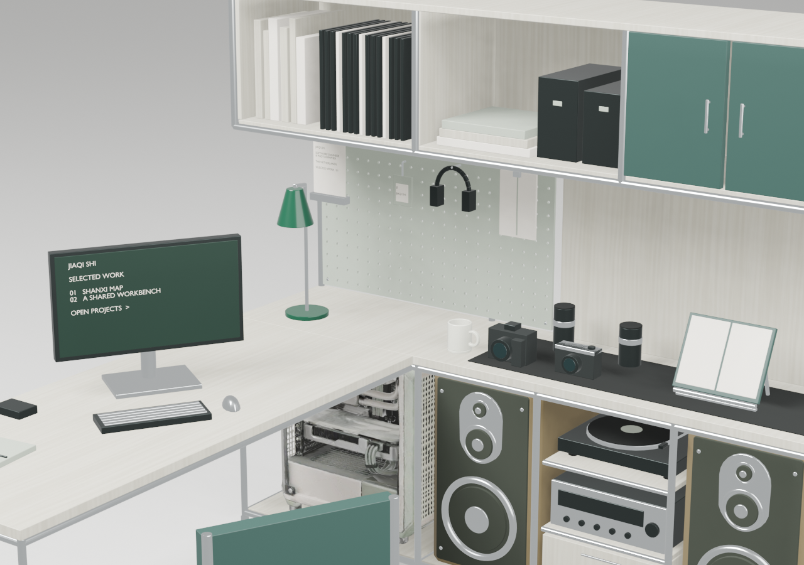
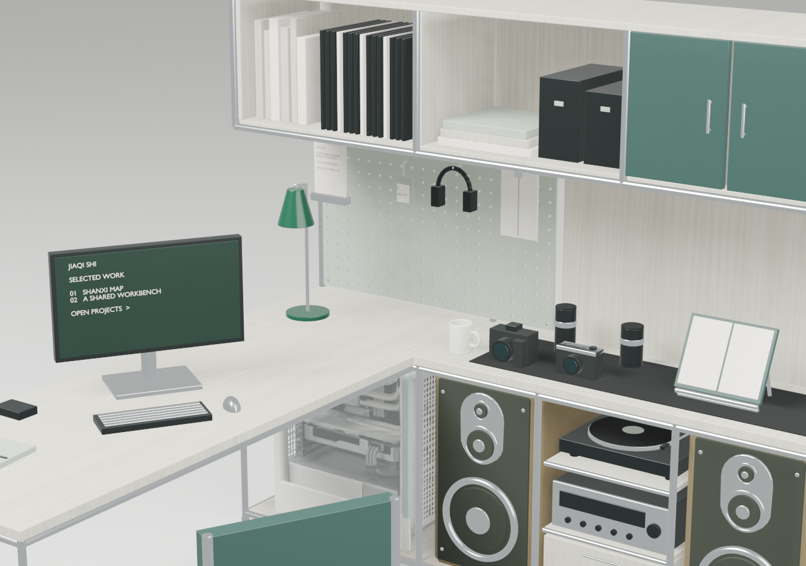

# Workstation lookdev — round 04 computer tower brief

Prepared: 2026-09-18

Status: corrected production candidate prepared locally; awaiting final visual confirmation

Baseline: the accepted Round 03 speaker checkpoint.

Supplied source asset: [`Computer Case.glb`](../assets/3d/Computer%20Case.glb), exported by Tripo. The source is approximately 63 MB and contains one mesh, one merged material and about 1.875 million triangles. It is a shape/reference source rather than a web-ready replacement: Round 04 must reduce its geometry and separate at least the case shell, window and restrained visible internals before integration.

## Supplied-asset fit preview — 19 September 2026

The source was cleaned without modifying the original, its 4K textures were reduced for preview use, and a 149,900-triangle derivative was placed in an isolated Blender copy. Its fitted envelope is approximately 554 × 298 × 620 mm. The glazed long side faces the default opening camera; the cabinet frame and accepted speaker remain in place.

This image was the composition gate. It established that the supplied silhouette reads immediately as a computer and fits the bay, while also exposing two conversion requirements: the photoreal texture and high-contrast internals were too prominent for the workstation, and the single merged material prevented independent window-opacity control. The fitted position, size and orientation were approved before production conversion.

### Stylized conversion preview

After the fitted composition was approved, a second isolated derivative reduced texture saturation and contrast, increased surface roughness, suppressed fine normal-map reflections, and added a separate warm shell, sage front rail and lightly smoked viewer-facing window. The interior remains readable at close range but no longer competes with the speakers or desktop objects in the overview. This visual-strength direction was accepted and used for the production conversion.

## Corrected production conversion — 20 September 2026

The first production export mistakenly ran a second destructive reduction pass after the approved preview. That changed the approved approximately 149,900-triangle case into a 32,598-triangle asset, producing ragged grille openings and erasing fan/cable detail. The same export also omitted the cabinet side panels that had framed and concealed the raw case edges. That version is rejected.

The corrected derivative now uses the approved preview geometry directly and does not perform the second collapse pass. The supplied source remains untouched. The production case is 149,930 triangles; the validated complete workstation is 13,175,308 bytes, 237,871 triangles and 191 meshes.

- The long glazed side faces the default opening camera.
- The original cabinet frame, both flanking cabinet side panels and the neighbouring speaker/storage structures remain present. The panels deliberately mask the irregular generated-case edges.
- The photographic blue/RGB cast is replaced by muted cream, warm white, restrained sage and pale smoked glass.
- Shell, accent, glass and muted internal assembly are independently exposed in the Surface editor.
- The active board preview is also recorded as warm-white insert with pale-green frame, matching the accepted thumbnail correction.
- The final local material pass reduces the fitted texture brightness by 8% and uses darker neutral smoked glass. Geometry and detail density remain unchanged.
- Default-camera browser inspection confirms that the tower reads as a computer while remaining subordinate to the workstation and speakers.

The reproducible browser checkpoint is [`workstation-lookdev-round-04.json`](./workstation-lookdev-round-04.json). This corrected candidate remains local and unpushed until visual confirmation; grille relief and shared material refinement remain scheduled for later rounds.

## Primary question

Can the pale-green under-desk cabinet immediately beside the left speaker become a clearly readable computer tower while preserving the calm lower-cabinet composition and the breathing room gained in earlier rounds?

## Object identity

- Target object: the pale-green cabinet beneath the desk, directly beside the left speaker.
- New role: desktop computer tower / PC case.
- This is not the central audio module and does not replace or modify either speaker.

## Allowed variables

- Computer-case silhouette inside the existing cabinet footprint.
- Front-versus-side panel construction, corner treatment and panel gaps.
- Restrained ventilation, power button, ports and one or two functional indicators.
- Small internal placement corrections required to prevent collision with the desk frame or speaker.
- Case-specific provisional colour blocks needed to read the geometry under neutral light.

## Frozen variables

- Both accepted Round 03 speakers, including their geometry, scale and placement.
- The central audio module and record-player stack.
- Desk, rear frame, storage, chair and felt-board geometry.
- Final material response, scene lighting and final palette; those remain separate later rounds.
- No transparent showcase side, RGB lighting or dense gaming-PC detail unless the user later supplies a reference that explicitly calls for it.

## Initial design direction

- Preserve approximately the current green cabinet's outer mass so the layout does not become crowded again.
- Make the object legible as a computer through construction and controls, not through logos or excessive detail.
- Keep it integrated with the workstation: stylised commercial 3D, broad controlled edges, satin panels and limited dark/metal accents.
- Treat pale green as provisional. Exact case colour is decided in Round 08 after material and lighting behaviour are stable.

## Reference decision — 2026-09-18

The supplied references establish three useful extremes: a fully transparent showcase case, an open/high-airflow perforated case and a quiet opaque louvered case. Round 04 Candidate B combines their relevant traits without copying any one enclosure:

- Opaque pale body and restrained overall silhouette from the quiet case.
- A smaller smoked translucent side window rather than a full transparent shell.
- A clear front intake using broad horizontal louvers rather than dense honeycomb.
- No visible RGB, illuminated internals, logos or display-oriented hardware.
- No interaction target; the case supports workstation identity rather than becoming a project entry point.

The original cupboard is approximately 674 mm wide. Candidate B keeps its speaker-side edge, height and depth but contracts to approximately 480 mm wide, preserving about 46 mm of clearance from the accepted left-speaker envelope. This proportion change is intentional: ventilation alone would not stop the original broad mass from reading as furniture.

## Candidate B implementation — 2026-09-18

Candidate B is now built parametrically in the Blender derivative and exported as part of the workstation GLB. The original `Corner_Undercounter_Cabinet` and `Corner_Undercounter_Door` are removed rather than hidden behind the new object.

| Feature | Candidate B value |
| --- | ---: |
| Case width | 480 mm |
| Case height | 636 mm shell; 660 mm including feet |
| Case depth | 398 mm shell; 430 mm including controls/feet envelope |
| Clearance to left speaker | approximately 46 mm |
| Side window | 294 × 330 mm smoked insert |
| Front intake | 300 × 410 mm dark recess with 11 broad louvers |
| Controls | one power button, two restrained ports and one status marker |

The case is non-interactive. It is also exposed as an independent `Computer tower` part in the lookdev Structure panel so its proportions and placement can be reviewed without resetting the workstation. `Computer case paint`, `Computer case dark` and `Computer case glass` are independent materials. The Surface panel now exposes opacity; for the glass material, `0.10–0.18` tests a clearer window, `0.30–0.45` tests the recommended smoked translucency and `1.00` tests an opaque insert.

### Automated evidence

- GLB structural validator: pass, including the Round 04 width envelope, speaker clearance and removal of the old cupboard door.
- Unit tests: 2/2 pass.
- Production build: pass.
- Browser regression suite: 24 passed, 1 intentionally skipped.
- Lint: 0 errors; the existing `CVLightbox.jsx` Fast Refresh warning remains.

### First fixed-view review

- Overall hierarchy: pass provisionally; the narrower case remains secondary to the workstation and speakers.
- Speaker clearance: pass; the accepted speaker geometry and placement are unchanged.
- Computer identity: provisional. The front intake and controls distinguish it from the old cupboard, but the user should decide whether the horizontal-louver language is sufficiently computer-like.
- Transparency: provisional. The default is smoked translucency; clear and opaque alternatives can now be compared in the browser without regenerating geometry.
- Final surface quality and colour: deferred to Rounds 06 and 08.

## Decision gate

Candidate B is **provisional**. Approval should answer three questions only: whether the 480 mm width feels right, whether the louvered front reads as a computer rather than a cabinet or radiator, and whether the side panel should remain smoked, become clearer or become opaque. Internal hardware, final materials and final colour are outside this decision.

## Candidate B rejection and Candidate C correction — 2026-09-18

Candidate B is **rejected** after review. It misread the supplied references in two connected ways: the broad ventilated front faced the opening camera instead of the characteristic glazed side, and contracting the case to 480 mm created an unattractive unused gap in the original under-counter bay. As a result, the case's distinctive construction was hidden while the composition became weaker.

Candidate C replaces rather than tweaks that arrangement:

- The tower is side-on, with a 620 mm long side facing the opening camera.
- The glazed side becomes the dominant visible face, following both supplied transparent/open-side references.
- The ventilated front turns to the left end, remaining partially visible in perspective.
- The speaker-side edge remains fixed and the longer body recovers most of the former cabinet span.
- Two muted fan rings, a board silhouette and a lower shroud sit behind smoked glass; there is no RGB lighting or dense component modeling.
- The side-window opacity remains adjustable for the transparent, smoked and opaque comparison.

### Candidate C internal-detail revision

The user accepted Candidate C's side-on orientation and viewer-facing window, so it must not be rolled back. The next revision changes only visibility and internal content:

- Glass moves from dark smoked opacity to a clearer pale-smoked response.
- Internal visibility increases substantially without adding RGB lighting.
- The visible system follows references P1/P2 at a simplified level: motherboard, CPU block, horizontal graphics card, top radiator with three fans, rear fan, RAM, lower power shroud and ordered cable/coolant runs.
- Exterior placement, side-window orientation and overall case direction remain frozen for this revision.

## Acceptance criteria

1. It reads as a computer tower in Overview without needing a label.
2. It remains secondary to the monitor and workstation as a whole.
3. It does not crowd, overlap or visually merge with the adjacent speaker.
4. The desk frame and lower storage openings remain physically credible.
5. Detail density matches the simplified speakers and furniture rather than becoming photorealistic or game-like.
6. Overview, Work and Photography views remain usable at desktop and mobile sizes.

## Decision needed before modeling

The round can begin with a restrained studio/workstation tower direction. If the user supplies a preferred computer-case reference before implementation, silhouette and ventilation language should be derived from that reference while preserving the accepted footprint.
